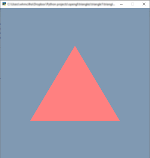

# triangle1.

The file `triangle1.py` draws a triangle in a window. That's all. Nearly 100 lines.

The program needs Python 3.something, pyglet, and pyshaders. (I know this is supposed to be a base level program, with nothing but open gl calls, but pyshaders is sooo good.) The program also uses shader language 300 es, so you might need to change the line
```
#version 300 es
```
to
```
#version 330 core
```
to get it to work. This code was run using the **spyder** environment.

## The code.

Anyway, here's the walkthrough of the code. First, we import the necessary libraries.

```python
import pyglet
from pyglet import gl
import ctypes
import pyshaders

window = pyglet.window.Window(width=600, height=600)
```
I open up a pyglet window here, for some reason. Should probably do it later. By the way, if the program crashes later, you need to type `window.close()` at the command prompt.

The next part of the program defines the vertex shader and fragment shader. The `in vec4 position` is the vertex position which will be defined later. The `layout(location=0)` lets you connect it up easily to the rest of the program.

The fragment shader just colours the triangle pink.
```python
# SHADERS - not doing much here.

# using opengl 300 es for the shaders, as this gives me location & in/out
# which modern opengl shaders use.

def setup_program():
    
    vertex_shader = '''
        #version 300 es
        precision mediump float;
        layout(location = 0) in vec4 position;

        void main()
        {
            gl_Position = position;
        }
    '''

    fragment_shader = '''
        #version 300 es
        precision mediump float;
        
        out vec4 fColor;
        
        void main()
        {
             fColor = vec4(1.0, 0.5, 0.5, 1.0);
        }
    '''

    program = pyshaders.from_string(vertex_shader, fragment_shader)
    program.use()
    return program

program = setup_program()

```
## Vertex Array Objects.

OK, pyshaders made that easy. The next part is where we get into the grime and dirt at the bottom of the open gl barrel. We have to create three vertices to draw. But to do *that* we have to create some open gl structures to hold the vertex data (and, as it happens, anything else we want). 

Our vertex data is going to go in a **Vertex Array Object**. A vertex array object can hold one or more **Array Buffers**, which contain per-vertex information, such as where the vertex actually is.

Now, we can't actually get ourselves a vertex array object, or even a pointer to it. Open GL won't let us. Instead, we get an integer *handle* to the object. This is what we do next:

```python
# VERTICES

VAO = gl.GLuint(0)

# create the VAO

gl.glGenVertexArrays(1, ctypes.byref(VAO)) 
gl.glBindVertexArray(VAO) # makes the handle currently active
```
The call to `glGenVertexArrays` takes two parameters: the 1 says we want to make one vertex array object (you can make more) and the second parameter is a pointer to an integer (it's easier in C, but not much else is) or array of integers. The call changes the value of `VAO` to the handle. If you print it out at this point, you will get a value different from zero.

The second call `glBindVertexArray` makes the handle the currently active vertex array object. All functions from here onwards that concern vertex array objects will affect the one you bound with this call. To unbind it, call `glBindVertexArray` with a different vertex array object handle, or do `glBindVertexArray(0)`. 

## Vertex Buffers.

A buffer is where you put the data that opengl needs to draw something. So we need to create a buffer and fill it with three triangle vertices. That's what we do here: 

```python
# create vertex buffer for a triangle
VBO = gl.GLuint(0)

gl.glGenBuffers(1, ctypes.byref(VBO)) # creates a handle to a VBO object
gl.glBindBuffer(gl.GL_ARRAY_BUFFER, VBO) # makes the buffer currently active
```
First, we create a handle to a buffer with `glGenBuffers` (analogous to `glGenVertexArrays`) which creates one (or more) buffer handles, and stores the handle value in `VBO`. Then we **bind** the buffer with the call `glBindBuffer`. Now, since `VAO` is the currently bound vertex array object, the vertex buffer gets added to the vertex array object. Thus, the object `VAO` now owns `VBO`. 

Also, binding makes `VBO` the current vertex buffer, so all vertex-buffer-related calls use it as a target. The constant `GL_ARRAY_BUFFER` just means this buffer is for vertex attributes. 

It's quite hard to keep track of all the implications about which objects are affected by which functions. Unless you're  an expert, which I'm not.

The next step is to shove some vertices in the buffer:

```python
# make data and put in buffer
VERTEX = gl.GLfloat*3

data = (VERTEX * 3)((-0.6, -0.5, 0.1),(0.6, -0.5, 0.1), (0.0, 0.5, 0.1))
gl.glBufferData(gl.GL_ARRAY_BUFFER, ctypes.sizeof(data), data, gl.GL_DYNAMIC_DRAW)
```
First, we create a C-compatible data structure which holds 9 floats, the (x,y,z) coordinates of each point. Note that since we aren't bothering with perspective and whatnot, all our points have to fall inside a cube with coordinates -1...1 in all directions, in order to be seen. However, negative z values fall behind the camera, so they won't get seen either.

Then, we call `glBufferData` to put the data in the currently active buffer (which is `VBO`). The first parameter is the same as before, the second one says how many bytes the data is. This call doesn't care how the data is structured. The last constant `GL_DYNAMIC_DRAW` is a hint to opengl about where to eventually store the data.

## Plumbing.

OK, how does opengl know that this data we just created is vertices? We have to tell it. Right at the top, in the vertex shader, there was a line that said 
```
layout(location = 0) in vec4 position;
```
This value was then assigned to the special variable `gl_Position`, which **is** the vertex position as far as open gl is concerned. What we have to do is connect our buffer up to the shader variable `position` in the fragment shader, so it then gets assigned to the vertex position `gl_Position`. 

Here's the incantations to do that:

```python
# connect the buffer to location=0

gl.glEnableVertexAttribArray(0) # like pyshaders.attr.enable()
gl.glVertexAttribPointer(0, len(VERTEX()), gl.GL_FLOAT, False, ctypes.sizeof(VERTEX), 0)
```
The first call `glEnableVertexAttribArray` enables the variable in location 0. No idea why it isn't already enabled, but there you go. 

The next call `glVertexAttribPointer` connects our buffer `VBO` (which, remember, is *still* the active buffer) to the `position` variable, and tells opengl how to break up the contents of the buffer into vertices. The parameters to the call are:

* `0` is the location in the shader of the variable `position` that we're plumbing to our vertex buffer
* `len(VERTEX())` is the number of components in a vertex (NB `VERTEX` is a class, so `VERTEX()` instantiates one just to get the length), which is 3.
* `GL_FLOAT` is the size of each number in the buffer
* `False` is a flag saying whether the coordinates need to be normalized (no, in this case).
* `ctypes.sizeof(VERTEX)` is the number of bytes in a vertex. This is the stride, which is necessary for non-contiguous data. Since our vertex buffer gives the vertices contiguously, we could have gotten away with putting 0 here, and then opengl would have worked out the stride from arguments 2 and 3.
* 0 is the offset from the start of the buffer that the first vertex is at. Again, mostly for non-contiguous data.

One last thing, we unbind the vertex array object:

```python
gl.glBindVertexArray(0) # unbinds the VAO we were using
```
Not sure if I need to unbind the VBO. Probably, but this program is simple enough that I can get away with a few loose ends.

## Drawing.

Now, finally, we are in a position to draw the damn triangle. We set up an `on_draw` event for our pyglet window as follows:
```

# RUN 

@window.event
def on_draw():
    gl.glClearColor(0.5, 0.6, 0.7, 1.0)
    gl.glClear(gl.GL_COLOR_BUFFER_BIT | gl.GL_DEPTH_BUFFER_BIT)
    gl.glBindVertexArray(VAO)
    gl.glDrawArrays(gl.GL_TRIANGLES, 0, len(data))

```
The first line sets the background colour and the second line draws it. The third line `glBindVertexArray` makes our vertex array object active again. The last line `glDrawArrays` draws all the buffers in the active vertex array object; by that, I mean it sends the data down the pipeline to the vertex shader.

Finally, we run the program:

```python
gl.glEnable(gl.GL_DEPTH_TEST) # 3d
pyglet.app.run()
```

You *should* see something like this (Windows 10):



You can exit the program by hitting the escape key or closing the window.


