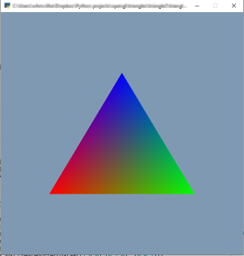

# triangle2.

This time around we're going to colour the triangle by adding a colour attribute to each triangle vertex. But first ...

## Boilerplate.
One of the biggest problems with Open GL is the amount of repetitive boilerplate you need to generate; enough to build a battleship. The boilerplate is crying out for being encapsulated in a library, and so I wrote one, called `cauldron.py` (so named because it helps out with Open GL incantations. Yes, I've changed the metaphor. Pray I don't change it again).

If you look at the code to create a vertex array object and make it active, 
```python
VAO = gl.GLuint(0)
gl.glGenVertexArrays(1, ctypes.byref(VAO)) 

# create vertex buffer for a triangle
VBO = gl.GLuint(0)

gl.glGenBuffers(1, ctypes.byref(VBO)) # creates a handle to a VBO object
gl.glBindBuffer(gl.GL_ARRAY_BUFFER, VBO) # makes the buffer currently active

# ... more code here

gl.glBindVertexArray(0) # unbinds the VAO we were using
```

it looks like it's crying out for a context manager. Something like this:

```python
class VertexArrayObject:
    def __init__(self):
        _vao = gl.GLuint(0)
        gl.glGenVertexArrays(1, ctypes.byref(_vao))
        self._vao = _vao
        
    def __enter__(self):
        # binds the vertex array object 
        gl.glBindVertexArray(self._vao)
        return self
    
    def __exit__(self, extype, exvalue, extraceback):
        # releases the vertex array object
        gl.glBindVertexArray(0)
```
So when you create a `VertexArrayObject`, it creates the handle. Then if you use it in a `with` statement, it binds the handle at the start, and unbinds it at the end. So you could instead write

```python
VAO = VertexArrayObject()

with VAO:
    VBO = gl.GLuint(0)
    gl.glGenBuffers(1, ctypes.byref(VBO)) # creates a handle to a VBO object
    # ... etc.
```
The vertex buffer object `VBO` isn't a context here, but it should be. `cauldron` makes it one.

## `cauldron`

We're going to use `cauldron` from here on, so it might be an idea to document it.

### `cauldron.VertexArrayObject`
Encapsulates an Open GL vertex array object and manages its context.
* `__init__(self)`

  Creates the object. Takes no parameters. For example
  ```python
  VAO = VertexArrayObject()
  ```
* `__enter__`, `__exit__` 

  implement the context manager. You will only rarely need this, I hope.
* `createBuffer(self, target=gl.GL_ARRAY_BUFFER, usage=gl.GL_DYNAMIC_DRAW, data=None)`

  creates a vertex buffer attached to this vertex array object. If `data` is given as a list, tuple, or `numpy` array, the buffer is filled with the data. If not, you can fill it later (see `setData` below).
* `drawArrays(self, mode=gl.GL_TRIANGLE_STRIP, first=0, count=None)`

  makes the vertex array object active and sends all the connected buffer data to the Open GL renderer. You normally won't have to supply `count` as it is worked out from the data that's been stored in the buffers, but it can be supplied to draw fewer points. 

### `cauldron._VertexBufferObject`
This is created by a call to `VertexArrayObject.createBuffer(...)`
* `__init__(self)`

  Creates the object. You normally won't create a buffer yourself, because it won't be attached to a vertex array object if you do (unless you make it active).
* `__enter__`, `__exit__`

  implement the context manager. You will only rarely need this, I hope.
* `setData(self, data, target=None, usage=None)`

  used to add or change the data in an existing buffer. If the buffer was created with data, you won't use this unless you change it. `target` and usage default to the values used when the buffer was created, but you can change them if you want when setting the data.

  The data should be structured to give `cauldron` information about the layout. If you're creating three x,y,z vertices, for example, data should be a tuple of tuples, for example `((-0.6, -0.5, 0.1), (0.6, -0.5, 0.1), (0.0, 0.5, 0.1))`. If it was only the x and y coordinates, it would be `((-0.6, -0.5), (0.6, -0.5), (0.0, 0.5))` and it would be up to the vertex shader to add the z coordinate (and the homogeneous 4th coordinate). You treat colours in a similar way (on a scale of 0 to 1, not 0 to 255). If you're just passing in a single number for each vertex, say an index, the data is just a tuple `(1,2,3)`.

  The data object can be bigger or smaller than that used during initialization.

  Note that the data is always float-type. Integers are converted to floats. This just makes life easy, and if the integers aren't huge, has no loss of precision.
* `connectToShader(self, location, normalized=False)`

  connects the buffer to the shader `in` location, which must be an integer. If the location wasn't specified, use `program.attributes.<name of attribute>.loc` to get the location, where `program` is a shader created by pyshaders.

## The triangle2.py program.

This program draws a triangle with different colours on all vertices, and the colour is automatically interpolated between the vertices by Open GL. It uses `cauldron` to make life easier. Here's a walkthrough of the code.

First, we import the necessary libraries:

```python
import pyglet
from pyglet import gl
import ctypes
import pyshaders
from cauldron import VertexArrayObject

window = pyglet.window.Window(width=600, height=600)
```
The only thing new here is we import a single object from `cauldron`. The shaders have changed

```python
# SHADERS - color and location

def setup_program():
    
    vertex_shader = '''
        #version 300 es
        precision mediump float;
        layout(location = 0) in vec4 position;
        layout(location = 1) in vec4 color;

        out vec4 vcolor ;
        
        void main()
        {
            gl_Position = position;
            vcolor = color;
        }
    '''
```
Note that the vertex shader has *two* inwards variables `position` (as before) and `color`. These will connect up to two buffers that we make later. It also has an `out` variable which just passes the vertex colour along to the fragment shader.

The fragment shader has also changed a little:

```python
    fragment_shader = '''
        #version 300 es
        precision mediump float;
        
        in vec4 vcolor;
        out vec4 fColor;
        
        void main()
        {
             fColor = vcolor;
        }
    '''
```
It now has an `in` variable `color` which, since it has the same name as the vertex shader's variable, is connected to it. Now, the fragment shader sets the outward fragment color `fColor` to the inward `color` value. Open GL interpolates this value between the vertices when it runs the fragment shader.

```python
    program = pyshaders.from_string(vertex_shader, fragment_shader)
    program.use()
    return program

program = setup_program()
```
The last bit uses `pyshaders` to compile, link, and enable the program.

Now on to the buffers. Using `cauldron` this is simple:

```python
# VERTICES

VAO = VertexArrayObject()
# vertices
vertices = VAO.createBuffer(data=((-0.6, -0.5, 0.1), (0.6, -0.5, 0.1), (0.0, 0.5, 0.1)))
vertices.connectToShader(location=0)
```
Yup, that's it. I've created the vertex array object, attached a vertex buffer to it, and filled it with data. The `connectToShader` also ensures that the data from this buffer is fed into the vertex shader at location 0. If ypou didn't specify the location in the fragment shader, you'd have to use `location=program.attributes.position.loc` instead.

Now to do the same for the color buffer:

```python
# colors
colors = VAO.createBuffer(data=((1,0,0),(0,1,0), (0,0,1)))
colors.connectToShader(location=1)
```
The data from this buffer will be fed into location `1`, so it will become the colours. The first vertex will be red `(1,0,0)`, the next green `(0,1,0)` and the last blue `(0,0,1)`. These are floating point colours rather than 8 bit.

Let's finally run the program:
```python
# RUN 

@window.event
def on_draw():
    gl.glClearColor(0.5, 0.6, 0.7, 1.0)
    gl.glClear(gl.GL_COLOR_BUFFER_BIT | gl.GL_DEPTH_BUFFER_BIT)
    VAO.drawArrays()

gl.glEnable(gl.GL_MULTISAMPLE) # antialiasing
gl.glEnable(gl.GL_DEPTH_TEST) # 3d
pyglet.app.run()
```

The call `VAO.drawArrays()` makes the vertex array object active, and pumps all the buffer data off to Open GL, which feeds it to the vertex shader. 

If all goes well, you should get this:



## Without `cauldron`

If you want to see what the code would look like without using cauldron, have a look at `triangle2_with_boilerplate.py`

