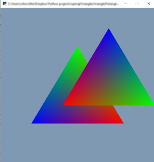

# triangle3

This one is just playing around, in the "oh, you can do that too" mode.

It initially shows two triangles, one behind the other (so you can't see the second). If you click the mouse, the front triangle moves to where the mouse is. Demonstrates:
* having two vertex array buffers, one for each object
* changing the data in a  vertex buffer.

Most of the code is the same as `triangle2.py`, with the following changes:

```python
# TRIANGLE1

VAO1 = VertexArrayObject()
# vertices
vertices = VAO1.createBuffer(data=((-0.6, -0.5, 0.5), (0.6, -0.5, 0.5), (0.0, 0.5, 0.5)))
vertices.connectToShader(location=0)
# colors
colors = VAO1.createBuffer(data=((0,0,1),(1,0,0),(0,1,0)))
colors.connectToShader(location=1)

# TRANGLE2

VAO2 = VertexArrayObject()
# vertices
vertices = VAO2.createBuffer(data=((-0.6, -0.5, 0.1), (0.6, -0.5, 0.1), (0.0, 0.5, 0.1)))
vertices.connectToShader(location=0)
# colors
colors = VAO2.createBuffer(data=((1,0,0),(0,1,0),(0,0,1)))
colors.connectToShader(location=1)

```

This part of the code creates two vertex array objects, one for each triangle. The first triangle has a z-coordinate of 0.5, which is further away than the second triangle. (Note: to get the depths working properly, you need to call `gl.glEnable(gl.GL_DEPTH_TEST)`, which is done in this file just before running the pyglet event loop.

The variables `vertices` and `colors` are re-used here.

The code also adds a mouse  press event to the window:
```python
dx = dy = 0

@window.event
def on_mouse_press(x,y,*args):
    global dx, dy, verts
    dx = (x-300)/300.0
    dy = (y-300)/300.0
    vertices.setData(((-0.6+dx, -0.5+dy, 0.1),(0.6+dx, -0.5+dy, 0.1), (0.0+dx, 0.5+dy, 0.1)))
```

The variables `dx` and `dy` will encode the position of the mouse click in the range -1..1. The call
`vertices.setData(((-0.6+dx, -0.5+dy, 0.1),(0.6+dx, -0.5+dy, 0.1), (0.0+dx, 0.5+dy, 0.1)))` changes the vertex data in the second vertex buffer, since that's what `vertices` was last assigned to.

Finally, the draw code is:
```python
@window.event
def on_draw():
    gl.glClearColor(0.5, 0.6, 0.7, 1.0)
    gl.glClear(gl.GL_COLOR_BUFFER_BIT | gl.GL_DEPTH_BUFFER_BIT)
    VAO1.drawArrays()
    VAO2.drawArrays()
```

All that changes is that we draw both vertex array objects, one after the other. The order doesn't matter because Open GL is doing depth ordering, but if it wasn't, the order would be important.

If you run this, you should get something like this after clicking the mouse:




